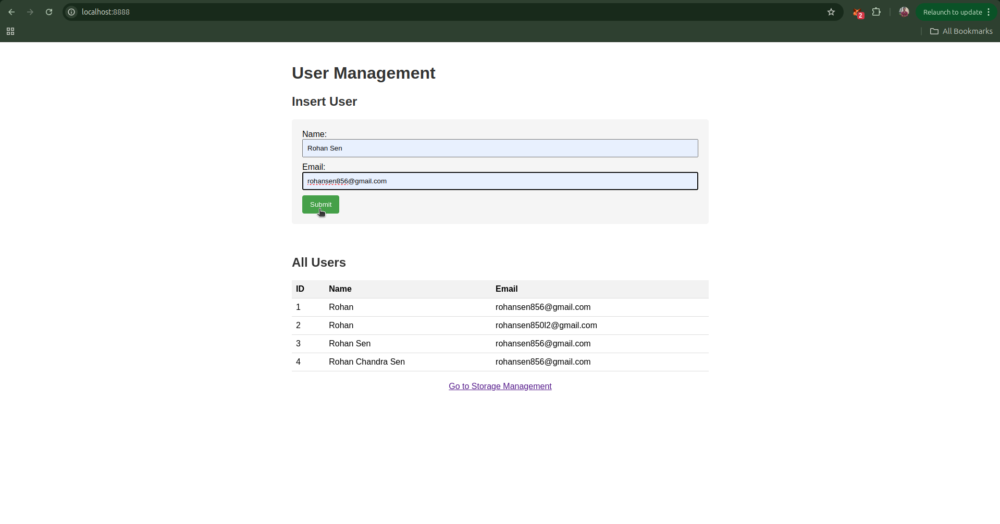
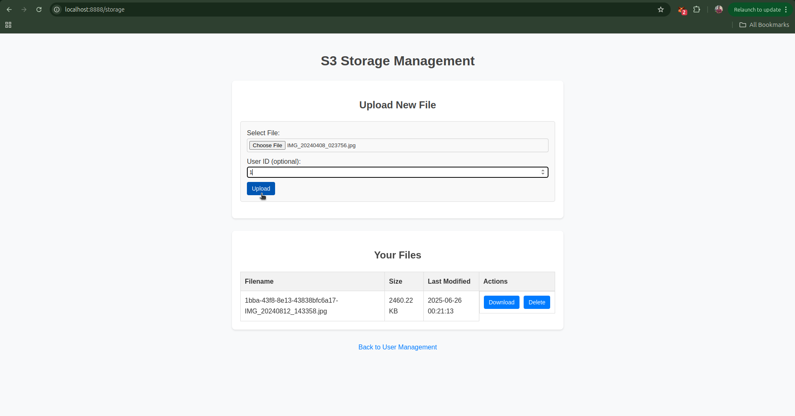

# Tornado Test Application with Amazon S3

This repository contains a web application built using the Tornado web framework and PostgreSQL as the database. The application provides CRUD operations for managing users and includes endpoints for file upload, download, and deletion, along with an echo endpoint for testing purposes.

## Features

- **Frontend**: HTML templates for user interaction.
- **Backend**: Tornado-based server with endpoints for:
    - Managing users (CRUD operations).
    - File upload, download, and deletion.
    - Echo endpoint for testing.
- **Database**: PostgreSQL integration for persistent data storage.
- **AWS S3 Integration**: File storage and retrieval using S3.
- **Validation**: Input validation for required fields.
- **Dockerized Setup**: Simplified setup using Docker Compose.

## Prerequisites

- [Docker](https://www.docker.com/) and [Docker Compose](https://docs.docker.com/compose/) installed.
- Python 3.8+ (if running locally without Docker).
- PostgreSQL installed (if running locally without Docker).
- AWS credentials configured for S3 integration.

## Setup Instructions

### Using Docker Compose

1. **Clone the repository**:
    ```bash
    git clone https://github.com/rohansen856/tornado_test.git
    cd tornado_test
    ```

2. **Start the application**:
    ```bash
    docker-compose up --build
    ```

3. **Access the application**:
    - Frontend: [http://localhost:8888](http://localhost:8888)
    - Backend API:
        - `GET /users`: Fetch all users.
        - `POST /users`: Create a new user.
        - `PUT /users`: Update an existing user.
        - `DELETE /delete`: Delete a file.
        - `POST /upload`: Upload a file.
        - `GET /download/<filename>`: Download a file.
        - `GET /echo`: Echo endpoint for testing.

4. **Stop the application**:
    ```bash
    docker-compose down
    ```

### Running Locally

1. **Clone the repository**:
    ```bash
    git clone <repository-url>
    cd tornado_test
    ```

2. **Install dependencies**:
    ```bash
    pip install -r requirements.txt
    ```

3. **Set up the PostgreSQL database**:
    - Create a database named `test`.
    - Update the connection details in `services/database.py` if necessary.

4. **Configure AWS S3**:
    - Ensure your AWS credentials are set up in `~/.aws/credentials` or via environment variables.
    - Update the S3 bucket name in `services/s3.py`.

5. **Run the server**:
    ```bash
    python server.py
    ```

6. **Access the application**:
    - Frontend: [http://localhost:8888](http://localhost:8888)
    - Backend API:
        - `GET /users`: Fetch all users.
        - `POST /users`: Create a new user.
        - `PUT /users`: Update an existing user.
        - `DELETE /delete`: Delete a file.
        - `POST /upload`: Upload a file.
        - `GET /download/<filename>`: Download a file.
        - `GET /echo`: Echo endpoint for testing.

## File Structure

```
tornado_test/
├── docker-compose.yaml   # Docker Compose configuration
├── requirements.txt      # Python dependencies
├── server.py             # Tornado server implementation
├── templates/            # HTML templates
│   └── index.html        # Frontend form for user interaction
├── handlers/             # Tornado request handlers
│   ├── main.py           # Main handler
│   ├── user.py           # User management handler
│   ├── storage.py        # File storage handler
│   ├── upload.py         # File upload handler
│   ├── delete.py         # File deletion handler
│   ├── download.py       # File download handler
│   └── echo.py           # Echo handler
├── services/             # Service modules
│   ├── database.py       # Database connection and queries
│   ├── s3.py             # AWS S3 integration
├── .gitignore            # Git ignore rules
└── README.md             # Project documentation
```

## API Endpoints

### `GET /users`
- Fetches all users from the database.
- **Response**:
    ```json
    {
        "users": [
            {"id": 1, "name": "Rohan Sen", "email": "rohansen856@gmail.com"}
        ]
    }
    ```

### `POST /users`
- Creates a new user.
- **Request Body**:
    ```json
    {
        "name": "Rohan Sen",
        "email": "rohansen856@gmail.com"
    }
    ```
- **Response**:
    ```json
    {
        "id": 1,
        "message": "User created"
    }
    ```

### `PUT /users`
- Updates an existing user.
- **Request Body**:
    ```json
    {
        "id": 1,
        "name": "Jane Doe",
        "email": "jane@example.com"
    }
    ```
- **Response**:
    ```json
    {
        "message": "User updated"
    }
    ```

### `DELETE /delete`
- Deletes a file from the S3 bucket.
- **Request Body**:
    ```json
    {
        "filename": "example.txt"
    }
    ```
- **Response**:
    ```json
    {
        "message": "File deleted"
    }
    ```

### `POST /upload`
- Uploads a file to the S3 bucket.
- **Request Body**:
    - Multipart form data with the file to upload.
- **Response**:
    ```json
    {
        "message": "File uploaded",
        "s3_key": "example.txt"
    }
    ```

### `GET /download/<filename>`
- Downloads a file from the S3 bucket.
- **Response**:
    - The requested file as a binary stream.

### `GET /echo`
- Echoes back a test message.
- **Response**:
    ```json
    {
        "message": "Echo successful"
    }
    ```

## Example Screenshot



## License

This project is licensed under the MIT License. See the `LICENSE` file for details.

## Acknowledgments

- [Tornado Web Framework](https://www.tornadoweb.org/)
- [PostgreSQL](https://www.postgresql.org/)
- [Docker](https://www.docker.com/)
- [AWS S3](https://aws.amazon.com/s3/)